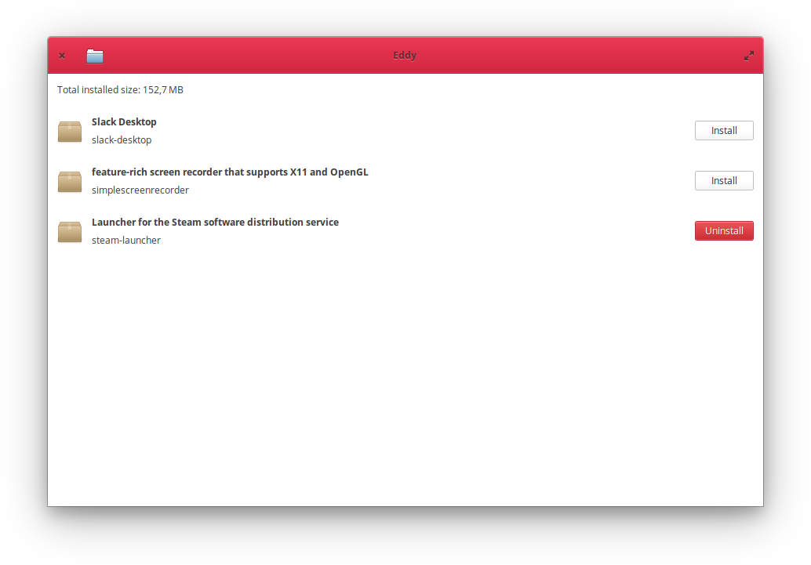

# eddy

### Simple debian package installer for elementary OS



Install, uninstall and view information about debian packages with easy to use graphical interface


## Installation

### Dependencies
These dependencies must be present before building
 - `gtk+-3.0`
 - `granite`
 - `packagekit-glib2`
 
 You can install these on a Ubuntu-based system by executing this command:
 
 `sudo apt install libgtk-3-dev libgranite-dev libpackagekit-glib2-dev libpolkit-gobject-1-dev`

### Building
```
mkdir build
cd build
cmake ..
make
```

### Installing
`sudo make install`
