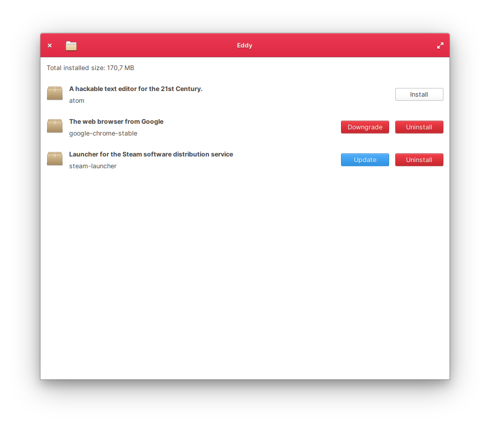

<div>
  <h1 align="center">Eddy</h1>
  <h3 align="center">A debian package installer for elementary OS</h3>
</div>

<br/>

<p align="center">
  <a href="https://appcenter.elementary.io/com.github.donadigo.eddy">
    
  </a>
</p>

<br/>



Install, update, uninstall and view information about debian packages.

Eddy can also support other packaging formats such as .rpm thanks to it's PackageKit backend, although it's primary focus is managing debian packages and being designed for elementary OS. 

## Installation

### Dependencies
These dependencies must be present before building
 - `valac`
 - `gtk+-3.0`
 - `granite`
 - `packagekit-glib2`
 - `unity`
 
 You can install these on a Ubuntu-based system by executing this command:
 
 `sudo apt install valac libgranite-dev libpackagekit-glib2-dev libunity-dev`

### Building
```
mkdir build
cd build
cmake ..
make
```

### Installing & executing
```
sudo make install
com.github.donadigo.eddy
```

### Reporting bugs & debugging
When reporting a bug you should include as much information as possible, that is the system that you're running, what you did in order to have the bug appear and probably a simple list of steps on how to reproduce the issue, however it is not required as some issues are not easily reproducible.

Additionally you can include a debug log in the description of the issue. To get a full log of backend and application messages, you can execute Eddy in a terminal with the following command:
`G_MESSAGES_DEBUG=all com.github.donadigo.eddy --debug`, reproduce the bug in the application window and copy the terminal output to the issue's description.
This information could really help localizing and fixing the issue.
